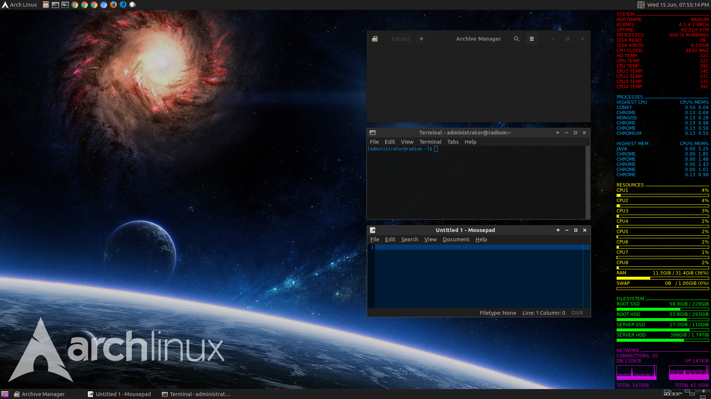

### Theme

My Gtk + Xfwm theme with wallpaper and Conky configuration.



### Install

Create the directory `~/.themes/Numix Dark` and copy the directories and files
listed below to the directory.

```
gtk-2.0
gtk-3.0
gtk-3.20
metacity-1
openbox-3
unity
xfce-notify-4.0
xfwm4
index.theme
```

Use the `wallpaper.jpg` and `conkyrc` files for the wallpaper and Conky
configuration.

### Requirements

Xfwm

Gtk+ 3.16 or above

Murrine theme engine
